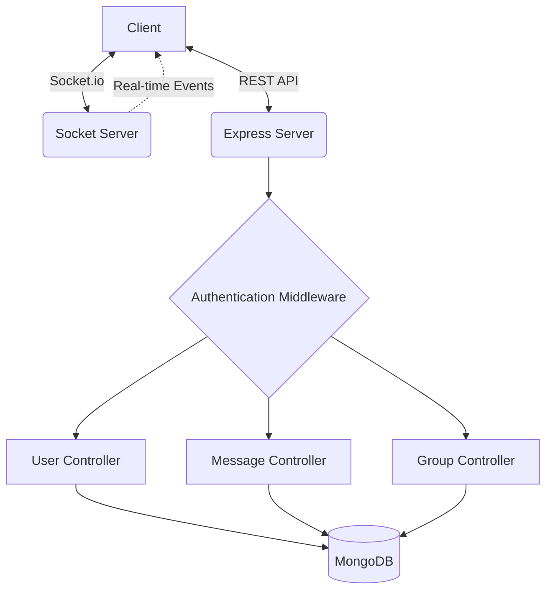

# 🚀 Lets Talk - Server Architecture & API Documentation

Welcome to the heart of **Lets Talk**! This backend is a high-performance, real-time communication engine built with Node.js, Express, and Socket.io.

## 🏗️ System Architecture

---

## 🔐 Authentication & Middleware

All routes except `/register` and `/login` are protected by the `isAuthenticated` middleware, which verifies the JWT token stored in cookies.

- **Security**: BcryptJS hashing for passwords.
- **Session**: JWT-based stateless authentication.
- **Error Handling**: Centralized global error middleware for consistent API responses.

---

## 🛣️ API Endpoints

### 👤 User Module (`/api/v1/user`)
Manage identities and discover friends.

| Method | Endpoint | Description | Auth |
|:---:|:---|:---|:---:|
| `POST` | `/register` | Create a new account | ❌ |
| `POST` | `/login` | Authenticate and get a token | ❌ |
| `POST` | `/logout` | Clear the session cookie | ✅ |
| `GET` | `/get-profile` | Fetch currently logged-in user data | ✅ |
| `GET` | `/get-other-users` | List all users except yourself | ✅ |

### 💬 Message Module (`/api/v1/message`)
The engine behind real-time conversations.

| Method | Endpoint | Description | Auth |
|:---:|:---|:---|:---:|
| `POST` | `/send/:receiverId` | Send a message to a User or Group | ✅ |
| `GET` | `/get-messages/:id` | Fetch history for a conversation | ✅ |

> [!TIP]
> The `:receiverId` can be either a **User ID** (for private chat) or a **Conversation ID** (for group chat). The server automatically detects the context!

### 👥 Group Module (`/api/v1/group`)
Collaborate with multiple people at once.

| Method | Endpoint | Description | Auth |
|:---:|:---|:---|:---:|
| `POST` | `/create` | Create a new group with participants | ✅ |
| `GET` | `/all` | Fetch all groups you are a member of | ✅ |

---

## ⚡ Real-time Events (Socket.io)

The server maintains a live map of online users to ensure ultra-low latency message delivery.

### 📡 Outgoing Events (Server -> Client)
- `onlineUsers`: Broadcasts a list of all currently active user IDs.
- `newMessage`: Pushes a fresh message object to the recipient(s) instantly.

---

## 🛠️ Data Models
- **User**: Stores profiles, passwords, and avatars.
- **Message**: Tracks the sender, receiver (optional for groups), and raw content.
- **Conversation**: The glue that binds participants and their message history. Supports both 1-on-1 and Group modes.

---

## 🚦 Getting Started
Check the `README.md` in the server root for environment variable setup and installation guides!
